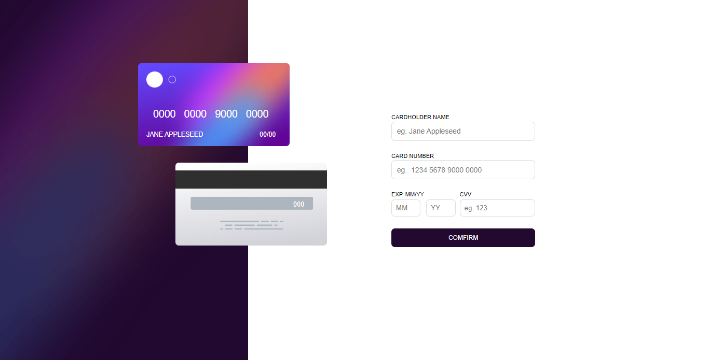
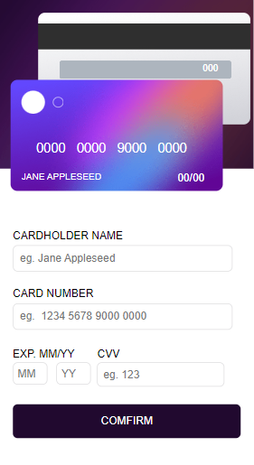
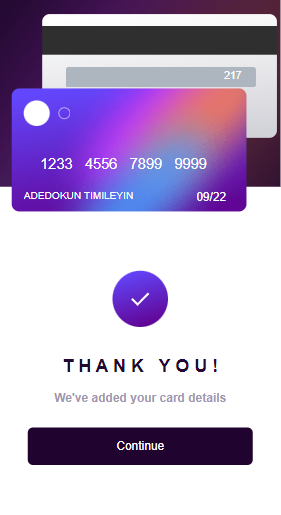
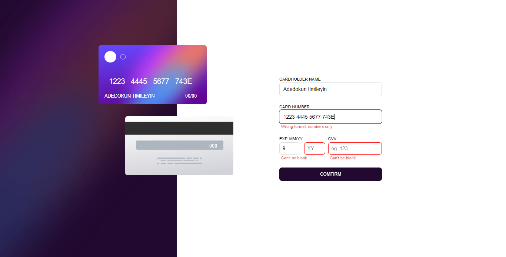

# Interactive-card

# Frontend Mentor - Interactive card details form solution

This is a solution to the [Interactive card details form challenge on Frontend Mentor](https://www.frontendmentor.io/challenges/interactive-card-details-form-XpS8cKZDWw). Frontend Mentor challenges help you improve your coding skills by building realistic projects.

## Table of contents

- [Overview](#overview)

  - [The challenge](#the-challenge)
  - [Screenshot](#screenshot)
  - [Links](#links)

- [Author](#author)

## Overview

### The challenge

Users should be able to:

- Fill in the form and see the card details update in real-time
- Receive error messages when the form is submitted if:
  - Any input field is empty
  - The card number, expiry date, or CVC fields are in the wrong format
- View the optimal layout depending on their device's screen size
- See hover, active, and focus states for interactive elements on the page

### Screenshot

Interactive-card-desktop.png
Interactive-card-form-mobile.png
mobile-complete.png
Interactive-card-desktop-complete.png
Interactive-card-active-desktop.png

screenshot\Interactive-card-active-desktop.png
screenshot\Interactive-card-active-desktop.png

### Links

- Solution URL: (https://github.com/Timley53/Interactive-card.git)
- Live Site URL: (https://interactive-cards-timley53.netlify.app)

## My process

### Built with

- Semantic HTML5 markup
- CSS custom properties
- Flexbox
- CSS Grid

## Author

- Website - [AdedokunTimileyin](https://www.linkedin.com/in/timileyin-adedokun-35b36b219)
- Frontend Mentor - [@TImley53](https://www.frontendmentor.io/profile/yourusername)
- Twitter - [@timley_kun](https://www.twitter.com/yourusername)
